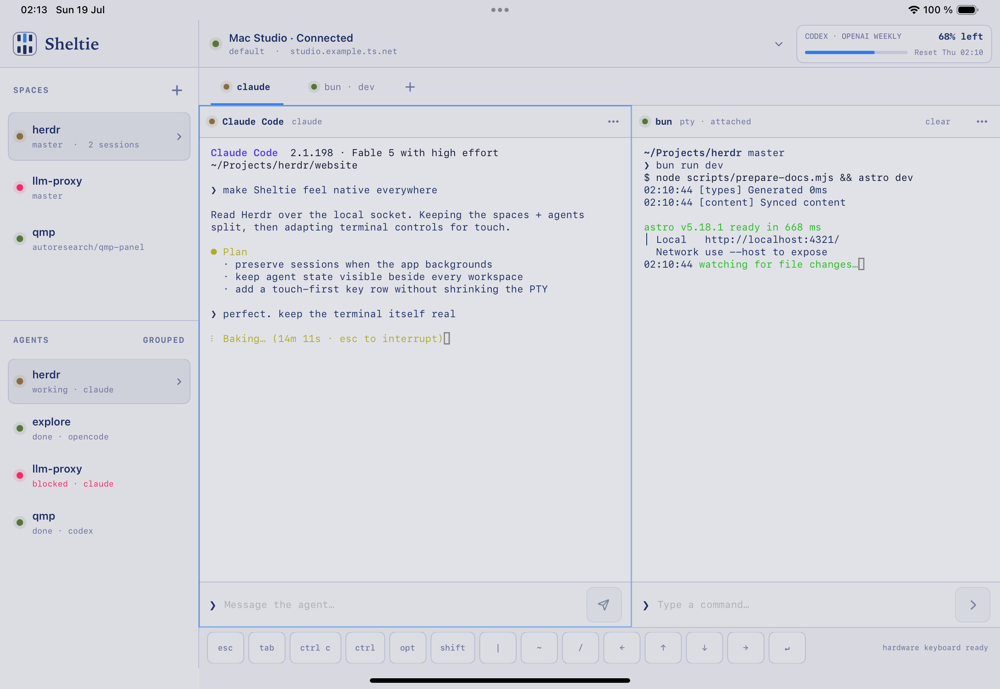
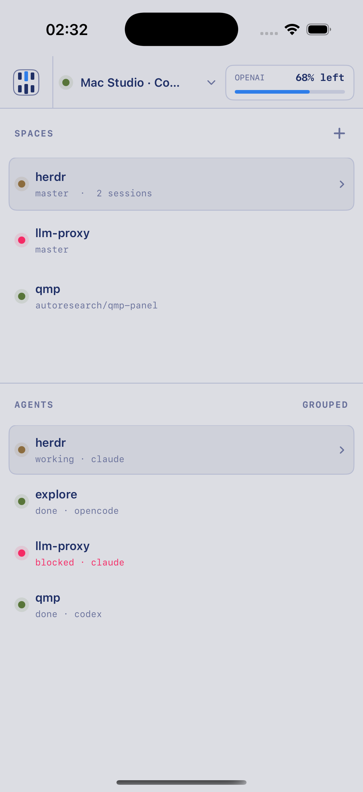
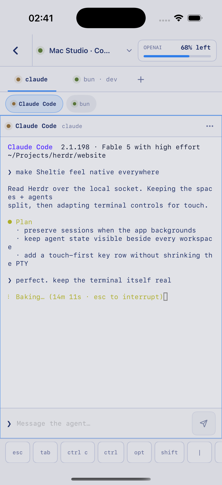

# Sheltie

Sheltie is a native iPhone and iPad client for [Herdr](https://herdr.dev). It recreates Herdr’s spaces, agents, tabs, split panes, and terminal controls with SwiftUI and UIKit while a loopback-only companion bridge talks to the existing Herdr server on the Mac.

> [!WARNING]
> This is an initial personal-use implementation, not a security-audited release. Keep the bridge tailnet-only, never enable Tailscale Funnel, and review the configuration before allowing terminal writes.

## Preview

### iPad



### iPhone

<p align="center">
  
  
</p>

## Implemented

- Native adaptive iPhone and iPad shell based on the approved local prototype
- Full-screen Spaces/Agents navigation and full-screen terminal workspaces on iPhone
- SwiftTerm-backed ANSI terminal panes with physical and software keyboard input
- Swipe-accessible, read-only terminal history backed by Herdr's recent scrollback
- Touch composers, special keys, sticky modifiers, context menus, and keyboard commands
- Spaces, grouped agents, tabs, recursive split layouts, focus, zoom, resize, move, rename, create, and close actions
- Persistent drag resizing between the Spaces and Agents sections
- Multiple paired Macs and multiple Herdr sessions
- HTTPS bootstrap plus authenticated WebSocket snapshots, actions, and terminal frames
- Herdr 0.7.3 live observer streams with a read-only `pane.read` fallback for older Herdr versions
- P-256 device pairing, Keychain/Secure Enclave identity, short-lived sessions, revocation, limits, and private audit records
- Optional trusted local provider-usage meters
- Demo data for deterministic simulator and UI verification

See [PLAN.md](PLAN.md) for product scope and remaining public-release decisions.

## Architecture

```text
iPhone/iPad app (SwiftUI + SwiftTerm)
        │ HTTPS / WebSocket over the tailnet
        ▼
Tailscale Serve (TLS + identity headers)
        │ loopback HTTP
        ▼
Sheltie bridge (Bun/TypeScript)
        │ Herdr Unix sockets + terminal observer processes
        ▼
Herdr server and its existing PTYs
```

The app never talks to Herdr’s private protocol directly and does not use SSH or `WKWebView`.

## Requirements

- Xcode 26 or a compatible current Xcode with iPhone and iPad simulators
- [XcodeGen](https://github.com/yonaskolb/XcodeGen)
- [Bun](https://bun.sh/) 1.3+
- Herdr 0.7.3+ recommended; 0.7.1 works through the polling fallback
- Tailscale Serve for device use

## Run the bridge locally

```bash
cd bridge
bun install
SHELTIE_DEV_MODE=1 bun run start
```

Development mode binds only to `127.0.0.1:9847` and accepts `Authorization: Bearer development`. Never expose development mode through Tailscale Serve.

Bridge tests:

```bash
cd bridge
bun run typecheck
bun test
```

See [bridge/README.md](bridge/README.md) for production configuration, pairing, optional usage data, and device revocation.

## Run the Apple mobile app

The generated Xcode project is committed, while `project.yml` remains authoritative:

```bash
cd ios
xcodegen generate
open Sheltie.xcodeproj
```

Run the `Sheltie` scheme on an iPhone or iPad simulator. Add the launch argument below for the deterministic design/demo workspace:

```text
--demo
```

Without demo mode, open the instance selector, enter the Tailscale Serve base URL, and enter the six-digit pairing code printed by the Mac bridge.

App and protocol tests:

```bash
swift test --package-path protocol

cd ios
xcodebuild -project Sheltie.xcodeproj \
  -scheme Sheltie \
  -destination 'platform=iOS Simulator,name=iPad Pro 11-inch (M4),OS=latest' \
  test
```

## Tailnet deployment

Configure the production variables in `bridge/.env.example`, run the bridge with a local service manager, and expose it under a path so it can coexist with Collie:

```bash
tailscale serve --bg --https=443 --set-path=/sheltie http://127.0.0.1:9847
```

Pair the app with:

```text
https://<mac-magicdns-name>/sheltie
```

Do not use a raw Herdr socket URL, public ingress, or Tailscale Funnel.

## Repository layout

```text
bridge/      Mac bridge, authentication, Herdr adapter, and tests
ios/         Native iPhone/iPad application and Xcode project
protocol/    Versioned Codable models, JSON schema, and fixtures
docs/        Design, protocol, and security documentation
do-not-commit/  Local ignored design references
```

## Design references

Local mockups and exports remain in `do-not-commit/`. That directory is ignored and must not be committed without an explicit content and licensing review.

## Relationship to Herdr

Sheltie is an independent client project and is not an official Herdr application.

## License

No project license has been selected yet. Public visibility does not grant permission to copy, modify, or redistribute Sheltie until a license is added. Third-party dependencies retain their own licenses; see [THIRD_PARTY_NOTICES.md](THIRD_PARTY_NOTICES.md).
